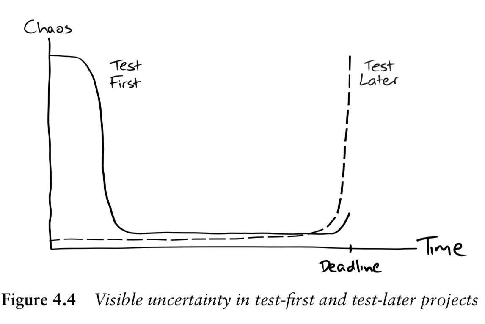
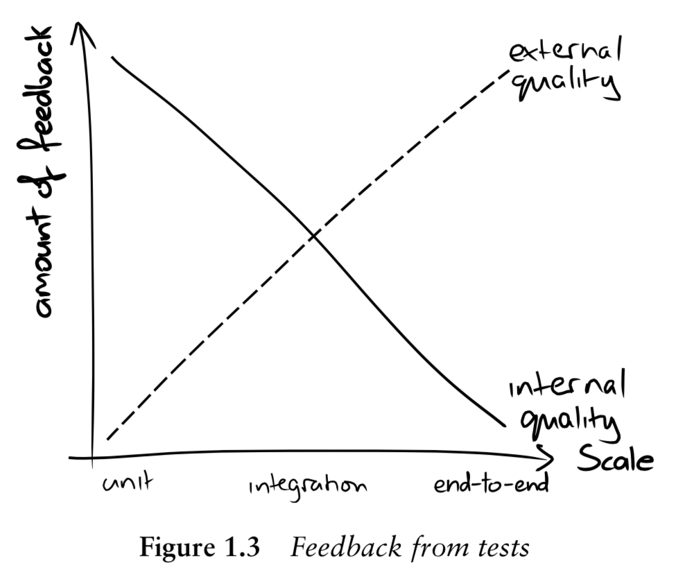
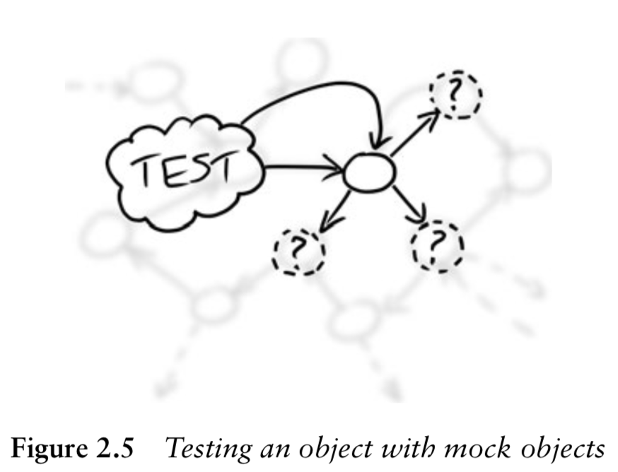

# Table of Contents

<!--ts-->
   * [How to build a software as driven by TDD](#how-to-build-a-software-as-driven-by-tdd)
      * [Acceptance tests](#acceptance-tests)
      * [Unit tests](#unit-tests)
   * [Levels of Tests](#levels-of-tests)
      * [Acceptance Tests](#acceptance-tests-1)
      * [Unit Tests](#unit-tests-1)
      * [Integration Tests](#integration-tests)
   * [Unit Tests](#unit-tests-2)
      * [How To write Unit Tests to drive TDD](#how-to-write-unit-tests-to-drive-tdd)
      * [Rules of Unit Tests](#rules-of-unit-tests)
      * [When NOT to depend on Unit Tests ?](#when-not-to-depend-on-unit-tests-)
      * [Features offered by a Unit Test library](#features-offered-by-a-unit-test-library)
         * [A. Verification](#a-verification)
            * [1. State verification](#1-state-verification)
            * [2. Behavior verification](#2-behavior-verification)
         * [B. Test Double](#b-test-double)
            * [1. Stub](#1-stub)
            * [2. Spy](#2-spy)
            * [3. Mock](#3-mock)
            * [4. Fake](#4-fake)
            * [5. Dummy](#5-dummy)
   * [Test Based Development Techniques](#test-based-development-techniques)
      * [Test Driven Development (TDD)](#test-driven-development-tdd)
      * [Behavior Driven Development (BDD)](#behavior-driven-development-bdd)
   * [User Story Template](#user-story-template)
   * [Contrast BDD over TDD](#contrast-bdd-over-tdd)
   * [How TDD helps to achieve High Cohesion &amp; Less Coupling among objects](#how-tdd-helps-to-achieve-high-cohesion--less-coupling-among-objects)
   * [Best Practices](#best-practices)
   * [Javascript Test Tools](#javascript-test-tools)
      * [Popular Javascript Unit Test Frameworks](#popular-javascript-unit-test-frameworks)
      * [Assertion Libraries](#assertion-libraries)
      * [Stub, Spy, Mock](#stub-spy-mock)
      * [End to End Tests](#end-to-end-tests)
      * [Code coverage report tool](#code-coverage-report-tool)
      * [BDD framework](#bdd-framework)


<!--te-->

# How to build a software as driven by TDD

- Start developing a software by defining the **acceptance tests** of that software.
  - Wite _stories_ to capture the requirement of a software. You may classify the _stories_ into _epics_ to group together similar themed stories.
  - Write _acceptance criteria_ to substantiate the story by describing what a stakeholder/tester/user expects to see once this piece of code is written
  - Convert this acceptance criteria into _acceptance tests_ to drive the development of our story till it's finishing point.
- Write **unit tests** with the aim to drive the development of your code. 
- _Write code_ enough to turn the unit tests green, and then perform _refactoring_ until the code turns into a good shape. 

## Acceptance tests

When you develop a software, the first step of implementation should be to define acceptance criteria. When you write acceptance tests, it gives the picture of the following :

- a _clarity_ on the acceptance criteria of _next piece of work_
- a _realization_ about when you are _done with that feature_, when your code satisfies acceptance tests.
- _proof that it works_, when it successfully runs acceptance tests.
- it acts as a _complete regression suite_, when all the acceptance tests of the system run successfully after each new feature development or changes are made to existing feature.
- acceptance tests _never invoke internal codes_. It _touches only the user interface_ like a third party system invoking a web service, thus ensuring that the new code _works from customer's view point_
- Acceptance tests are synonymous to _functional tests, customer tests, system tests_
- _Acceptance tests should be written in terms of application domain and not in the technology domain_. It shouldn't include the implementation details so that you won't tie your technical assumptions before starting to write code. Thus you would think in the user's point of view rather than the implementer's point of view when you start with a new feature.
- Acceptance tests helps us to _develop new feature from the inputs to the outputs_.
   You would start working on the new feature/system considering the events coming to the system to trigger certain behaviors. There are objects who act on the boundary level to receive these external events or inputs, and behave accordingly. To respond to the external event boundary objects would need to collaborate with several other objects, which goes by the chain of objects reaching the central domain of technology (may be database or file system lookup etc). And, pass the response via several objects until it reaches the boundary as response object. _It is tempting to start development from the central domain in TDD by writing unit tests, but that may lead to eventual integration troubles. So, always start with acceptance tests_.
 
## Unit tests

Once you write the acceptance tests, the next step is to build the code to pass acceptance tests using TDD. Several iterations of TDD life cycle eventually results in the finished code which passes the acceptance tests.
When you write unit tests, focus on the behavior of the object under tests to develop new feature and not just the methods. Beginners tend to simply write a unit test for every method they find. The right way is to put a meaningful name to the test method indicating a behavior of the new feature. And, this should be the driving factor for the development of new feature.

When you write the first unit test in TDD, you think of the function required and maps that to an object. That object might need the service of many other objects which are then mocked. Then unit tests for those service objects are created which results in more dependencies and mocks are created for them. This chain of objects end up touching the other end. Thus TDD would drive the design of your software.

The whole process can be illustrated by following diagram:


If you are building a new project from scratch:

- First you have to work out on how to build, deploy and test a _"walking skeleton"_
A _walking skeleton_ is the thinnest possible slice of a real functionality that you can automate build, deploy and test end-to-end.
(eg: of a walking skeleton for a database backed website would be a flat plain webpage showing some fields from db)
- Then you can create your acceptance tests using the infrastructure made for walking skeleton.

Difference between _test first_ vs _test later_ projects can be illustrated as :


We grow our system starting from the _walking skeleton_. As the code scales up, it occurs naturally to group those objects into packages, and packages into systems. To guide this structuring of code we can use two heuristics :

**Separation of concerns**

When you want to change a specific functionality of a system, if you were to make that change in multiple places, that looks like a code smell. You should have a clear separation of concerns while you design objects. So all the similar functionality related code sticks together. And, this results in high cohesion and less coupling.

When you are asked to explain what does an object perform, you should be able to explain the functions of object without using conjunctions such as AND, OR, BUT as they indicate code smell and possibility to split up that object into different objects - separation of concerns.

**Higher levels of abstraction**

It becomes much easier to work if you organize the complexity of programs into meaningful abstractions. For example, think of the difference in level of complexity between when you order a dish from menu in restaurant vs making an order providing details of recipe for that dish. 

Consider the complexity of a mechanical clock simplified with very simple interface and information hiding. To the external interface it provides only 3 hands and a control to adjust time, but to its inside there is a hell lot of gears and mechanisms. This is how you composite multiple objects together to form a simple higher level abstraction. This is in other words information hiding of an object and providing only absolutely necessary public APIs for external interface.

If you expose too much of detail from an object via it's public API, clients would end up doing some of the works intended to be done from the object itself. That is why you must have a clean high level abstraction.

# Levels of Tests

## Acceptance Tests

Also termed like End to End (E2E) Tests, Functional Tests, UI Tests
 
Tests on the use case scenarios. In this phase you test application entirely like how a user would interact with a website through a browser. This involves DOM parsing and UI tests.

_Acceptance tests generally proves that the whole system works._

For example on E2E, let's assume how E2E of mail application would look like:

1. Start a webserver to launch your mail application
2. Launch a browser
3. Log into a mail account
4. Open Inbox
5. Open a particular mail
6. Compose a reply to that mail
7. Send mail
8. etc
9. Log out of mail account

## Unit Tests
Tests a specific unit of functionality such as each methods in a class or plain functions. You focus only on that piece of code without depending on any other objects. Any dependencies smells like it could be redesigned to avoid dependency. If it is an essential dependency it could be replaced with a test double.

When you write unit tests, it enforces high cohesion and less coupling for the objects you make. Because coupling makes it difficult to write unit tests, and we have to resolve the dependencies involved in the coupling through test doubles (mock).

## Integration Tests
Though Unit Tests makes sure that each objects do work fine to meet their requirements, it may end in chaos while interacting with outside objects. Integration Tests rule out this issue by testing a specific interaction flow between an object and another object such as our piece of code interacting with DB, Network, File System etc or even interactions between two different class objects.

Integration tests helps to prove that our objects works well with other objects or system for which we don't have control.

For example on Integration Tests, let's assume how Integration Tests of API would look like:

1. Start a server and listen to HTTP requests
2. Grab a request and authenticate the user
3. Validate a request
4. Connect to DB and pull required data
5. Convert to JSON
6. Send back

Here, the complete workflow of an API request is tested through integration tests which covers the user request handling module, authentication module, DB interaction, and JSON conversion of response.

If a code that has some business logic prior to interacting with DB, the business logic units are tested using Unit Tests, and the interaction with DB is tested using Integration Tests.

The impact of different levels of tests and feedback it gathers can be understood from the picture below:


# Unit Tests
## How To write Unit Tests to drive TDD

In TDD, unit tests are driven through 3 stages in the following strategy.

**RED:** Just specify one of small requirement using a unit test which of course fails because the code is not yet written.

**GREEN:** Write the code just enough to make the above unit test as green. You may do hard coding or at worst do coding just enough with the aim to pass the above test. The prime goal in this step is to write code in smallest possible time not more than a few minutes.

**REFACTOR:** Then refactor codes to improve quality of codes and and clean them to remove hard coding.
This ensures to make __clean code that works__. _"Clean code"_ is ensured by _refactor stage_. And, _"that works"_ is ensured by _Red to Green_ stage

Generally, you would write unit tests on a class's public interface. Hence, that interface would evolve into an _easy to use_ one rather than an _easy to write_ and counter intuitive interface that you might develop otherwise.

We test only the target object in a unit test, where any other dependencies are simply mocked. 

The essential structure of a test looks like :

- Create any required _mock objects_
- Create any required _real objects_ including the _target object_
- Specify how do you _expect_ the mock object to be invoked by the target object
- _Trigger_ the call to test the target object
- _Assert the resulting_ values are valid and the _expected calls_ have been made.



Golden rule of TDD is:
_Never write new functionality without a failing test._
Every few minutes, unit tests helps to provide a proven code, that has been tested, designed and coded.

## Rules of Unit Tests

- Each test should be independent so that all the tests can be run simultaneously.
- Any dependencies for a particular test must be implemented using a _mock_ or _stub_. Do not depend on another test result.
- Each test should represent a unit of behavior.
- What we expect from a piece of code must be described through unit tests. So essentially we are writing specifications of project through each tests.
- In a way it is documenting behavior of a project through each test.
- Here you have to imagine at first what am I expected as result from executing a piece of code before even starting to write any code.
- As a result you will write only for the necessary scope of project. You don't end up writing any code unnecessarily. This approach is called **YAGNI - You Aren't Gonna Need It**.
- Unit tests should be fast in execution. By fast we can expect to see a 100 unit tests should be executed within 1 sec

## When NOT to depend on Unit Tests ?

Unit tests should strictly focus on the unit of functionality you are writing, which means there should be:
- No touch on file system
- No talk with DB
- No network traversal
- No configuration changes needed for a particular test
- The above kinds of tests are called integration tests.
- You don't need to test private methods. If there is need to test a private method, that indicates need for refactoring code for public interface.
- You don't need to test code which doesn't have any logic. For example, getters, setters, a method which simply invokes another method.

## Features offered by a Unit Test library

### A. Verification

#### 1. State verification
Checks if the SUT (System Under Test) has arrived at expected state during test execution.

#### 2. Behavior verification
Checks if a particular method is invoked during test execution.

### B. Test Double

#### 1. Stub 
If your unit test relies on another method which has complex logic but eventually returns a true or false, or a specific data, then you can substitute such complex methods with a shortcut function returning that expected return value. This approach in unit testing is called stubbing.

#### 2. Spy 
Spy is wrapper on an object to primarily serve two purposes. One is to identify how an object is being used, and second is to avoid alteration of a function behavior. When an object is invoked via spy it will monitor the parameters being passed, count of invocation etc.

#### 3. Mock 
Mock is like a spy + stub where it returns a pre-programmed response like a stub in addition to monitoring the invocation like spy. Mock is used when you want to track the behavior of invocation while providing hard coded response.

#### 4. Fake
If you need data to be retrieved from DB in order to execute test on a piece of code, then unit test doesn't need to bother about the DB dependency. In this case you could set a hard coded data to avoid executing complex DB data retrieval methods, and also you don't need to worry about DB connection failures. To ease with testing you could provide Fake object (for eg: which may be a list of employees), or an in-memory DB instead of real DB.

#### 5. Dummy
Dummy data passed to methods.

# Test Based Development Techniques

## Test Driven Development (TDD)

In TDD, development is done based on Unit Tests. Here, you would write a piece of code only to turn the _RED unit tests to GREEN_. Every bit of code is driven by unit tests.

## Behavior Driven Development (BDD)

BDD is a strategy build on top of TDD. In BDD, we focus on the user stories to build a software. 

- Write Unit Tests for a Story
- Code that story following TDD
- So here we code to the behavior represented in user story. BDD is TDD with strict focus on stories. Business people, Managers, Developers, Testers - all are looking into same set of stories.
- Stories are prioritized during sprint, and
- Each story reflects on the business value it provides. There is standard template for user story as presented below.
- There are test frameworks which works based on user stories based implementation such as _Cucumber_.

# User Story Template

**Title:** One line summary

**Narrative:** As a *role*, I want this *feature*, To get this *benefit*

**Acceptance criteria:** Specify scenarios which stakeholders do care about or a tester need to look into.

# Contrast BDD over TDD

_TDD_ essentially is locking us into the implementation style. But, _BDD_ only cares about the behavior, not your implementation style. Therefore, _BDD_ allows you to refactor a lot without causing troubles or test failures. But, _TDD_ would fail if you change implementation because _TDD_ is executed on each unit of code written.

Take for example your code has a logic to sort numbers in increasing order.

_TDD approach_ : Let's say you implemented sorting using Quick sort algorithm, and your unit tests verify that specific algorithm. If we happened to change the algorithm to Bubble sort for some reason, then your unit test would fail because it is expecting Quick sort algorithm.

_BDD approach_ : Let's say you implemented sorting using Quick sort algorithm, and your BDD is only verifying the outcome, not your specific algorithm. If we happened to change the algorithm to Bubble sort for some reason, then your BDD will not fail because it is expecting only the outcome or behavior to be sorted list of numbers no matter which algorithm is used.

# How TDD helps to achieve High Cohesion & Less Coupling among objects
Object oriented design deals with message passing between objects. Objects send messages to other objects, and they respond with some message. So essentially OOP is a collaboration between web of objects. A maintainable object oriented system is the one which focus on clear message passing instead of leaking any internal information of objects.

Take for example the following code where it is unnecessary for the Train object to know the intrinsic details of Carriage object.

**Example of bad message passing**

```java
public class Train {
    private final List<Carriage> carriages[...]
    private int percentReservedBarrier = 70;
 
    public void reserveSeats(ReservationRequest request) {
        for (Carriage carriage : carriages) {
            if (carriage.getSeats().getPercentReserved() < percentReservedBarrier) {
                request.reserveSeatsIn(carriage);
                return;
            }
        }
        request.cannotFindSeats();
    }
}
```
A better communication between objects would look like below code where Train object simply asked the Carriage object to know if there is seats available. The name of method is also refined.

This indicates high cohesion as the most suitable object to hold the behavior to check seat availability is Carriage itself.
As intrinsic details of Carriage object is moved out of Train object, it becomes less coupled, test friendly and maintainable.

**Example of good message passing**

```java
public void reserveSeats(ReservationRequest request) {
    for (Carriage carriage : carriages) {
        if (carriage.hasSeatsAvailableWithin(percentReservedBarrier)) {
            request.reserveSeatsIn(carriage);
            return;
        }
    }
    request.cannotFindSeats();
}
```

# Best Practices

- Having one test case per method is usually a bad thing!
- What you want is: One test case per behavior
- You want to have a list of “If you do this, it should react like that” sentences in executable form.
- Private methods don’t have any observable behavior. You test them implicitly through public API of the class.
- They are an implementation detail and it is not important if you have 0 or 100 private methods! For the test cases this should make no difference at all.
- Avoid constructors to have logic, condition clauses, initialization etc. Also, make sure that all the dependencies of an object is passed to it in its constructor itself. If all of these are injected to constructor, it highly improves testability.
- The business domain and technology domain are separate concerns and shouldn't be mixed up. We don't want technical concepts to leak into the business domain. There should an easy to replace interface between business domain and technology domain to bridge the gap between them.

---

# Javascript Test Tools

A **test framework** primarily serves two purposes : it would have a **test library** to _write tests_ and a **test runner** to _execute tests_.

## Popular Javascript Unit Test Frameworks

- Mocha
- Jasmine
- Qunit (from JQuery team)
- Jest (from Facebook)
- Karma

## Assertion Libraries

- Chai
- Should.js
- Assert.js
- Jasmine
- Jest

## Stub, Spy, Mock

- Sinon.js
- Testdouble.js
- Jasmine
- Jest

## End to End Tests

They are run from user's point of view (aka UI Tests on Browser)

- Protractor
- PhantomJS
- Casper.js
- Nightwatch
- Chromium project

Selenium Webdriver would be used by these libraries behind the scene to automate browser tests.

## Code coverage report tool

- Istanbul
- Blanket

## BDD framework

- Cucumber

---

Some frameworks are full fledged tools which executes everything starting from UI tests, 
Coverage, Performance, Snapshot testing, globals support, assertions - mock - spies support etc. For example, _Jest_ is such as full fledged framework used by Facebook. _Jest_ is based on _Jasmine_. 

_Smoke Test_ is a build verification testing which just verifies that core functionality of the new build is working fine, so that it can be taken for further level of testing. If smoke test fails, it means the build has to be simply rejected. If smoke test passes, it continues to next level of detailed testing.
